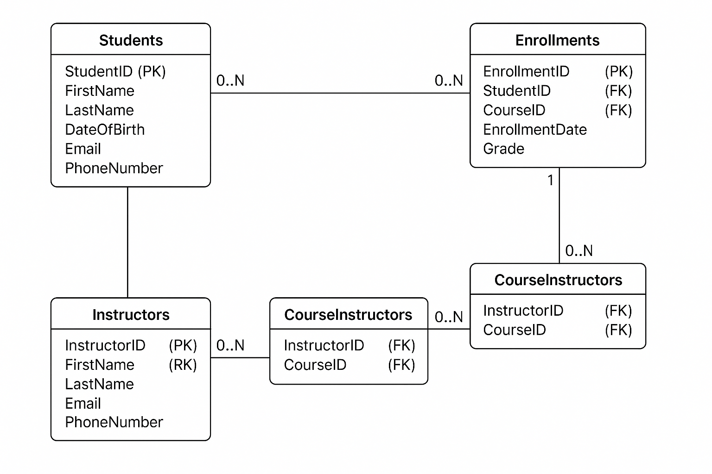

# Student Record System

## Project Overview
# **Student Record System**

This is a **Student Record System** designed to manage student data, course enrollment, and instructor assignments in a relational database. The system allows for easy tracking of students, courses, and enrollments using SQL, with proper database normalization and relationships.

## The ERD Diagram


## **Features**
- **Student Management**: Store and manage student details (name, email, phone, etc.).
- **Course Management**: Store and manage courses offered by the institution.
- **Enrollment Management**: Track student enrollments in various courses.
- **Instructor Assignments**: Assign instructors to specific courses.
- **Relational Database**: A well-structured relational database with relationships between tables (1:M, M:M).

## **Table Structure**

### **1. Students Table**
Stores information about students, such as name, date of birth, contact details, and student ID.

- **Columns**:
  - `StudentID` (Primary Key)
  - `FirstName`
  - `LastName`
  - `DateOfBirth`
  - `Email` (Unique)
  - `PhoneNumber`

### **2. Courses Table**
Stores information about the courses offered by the institution.

- **Columns**:
  - `CourseID` (Primary Key)
  - `CourseName`
  - `CourseDescription`
  - `Credits`

### **3. Enrollments Table**
Stores the enrollments of students in specific courses, with a many-to-many relationship between students and courses.

- **Columns**:
  - `EnrollmentID` (Primary Key)
  - `StudentID` (Foreign Key)
  - `CourseID` (Foreign Key)
  - `EnrollmentDate`
  - `Grade`

### **4. Instructors Table**
Stores information about the instructors who teach the courses.

- **Columns**:
  - `InstructorID` (Primary Key)
  - `FirstName`
  - `LastName`
  - `Email`
  - `PhoneNumber`

### **5. CourseInstructors Table**
Stores the relationship between instructors and the courses they teach.

- **Columns**:
  - `InstructorID` (Foreign Key)
  - `CourseID` (Foreign Key)


## Features
- Database schema design
- Data manipulation and querying
- Implementation of relationships and constraints
- Optimization of database performance

## Prerequisites
- Basic understanding of SQL
- Familiarity with database management systems (e.g., MariaDB, MySQL, PostgreSQL)
- Installed database software on your local machine

## Installation
1. Clone the repository:
    ```bash
    git clone https://github.com/Collins101-dev/Plp_Academy_Final_Database_Assignment.git
    ```
2. Navigate to the project directory:
    ```bash
    cd Plp_Academy_Final_Database_Assignment
    ```

3. Install MariaDB (You can use any DB)
    On Fedora
    ```sql
    sudo dnf install mariadb-server
    sudo systemctl start mariadb
    sudo systemctl enable mariadb
    ```
    On Ubuntu
    ```sql
    sudo apt update
    sudo apt install mariadb-server
    sudo systemctl start mariadb
    sudo systemctl enable mariadb
    ```
4. Set Up the Database
    ```sql
    mysql -u root -p
    CREATE DATABASE StudentRecordSystem;
    USE StudentRecordSystem;
    ```
5. Run SQL Script
    ```sql
    source create_tables.sql;
    ```

## Usage
1. Run the database server.
2. Execute the provided SQL scripts to interact with the database.
3. Modify or extend the schema as needed for your assignment.

## Testing

This project uses MariaDB as the database management system. Below are the sample tests to verify the functionality of the database:

### 1. Verify Database and Tables
Ensure the database and tables are correctly created:
```sql
SHOW DATABASES;
SHOW TABLES;
```

### 2. Test Data Insertion
Insert sample data into the tables:
```sql
INSERT INTO Courses (CourseName, CourseDescription, Credits)
VALUES ('Introduction to Programming', 'Learn the basics of programming using Python.', 3);
```

### 3. Test Data Retrieval
Retrieve data using `SELECT` queries:
```sql
SELECT * FROM Students;
```

### 4. Verify Constraints
Test the following constraints:
- **NOT NULL**: Attempt to insert `NULL` into a column with a `NOT NULL` constraint.
```sql
INSERT INTO Students (FirstName, LastName, DateOfBirth) VALUES ('Alice', 'Johnson', '1999-08-23');
```

- **UNIQUE**: Try inserting duplicate values into a column with a `UNIQUE` constraint.
```sql
INSERT INTO Students (FirstName, LastName, DateOfBirth, Email) 
VALUES ('Bob', 'Williams', '2001-01-01', 'john.doe@example.com');
```

- **FOREIGN KEY**: Test referential integrity by inserting or deleting related records.
```sql
INSERT INTO Enrollments (StudentID, CourseID, EnrollmentDate, Grade)
VALUES (999, 1, '2025-09-01', 'A');
```

### 5. Test Relationships
Use `JOIN` to find all courses a student is enrolled in:
```sql
SELECT s.FirstName, s.LastName, c.CourseName
FROM Students s
JOIN Enrollments e ON s.StudentID = e.StudentID
JOIN Courses c ON e.CourseID = c.CourseID
WHERE s.StudentID = 1;
```

These tests ensure the database is functioning as expected and adheres to the defined schema and constraints.


## Contributing
We welcome contributions to improve the project. To contribute:

Fork the repository.

Create a new branch 
  ```bash
git checkout -b feature-branch
```
Make changes and commit
 ```bash 
 git commit -m "Add feature"
```
Push to your fork 
```bash 
 git push origin feature-branch
```
Open a pull request with your changes.


